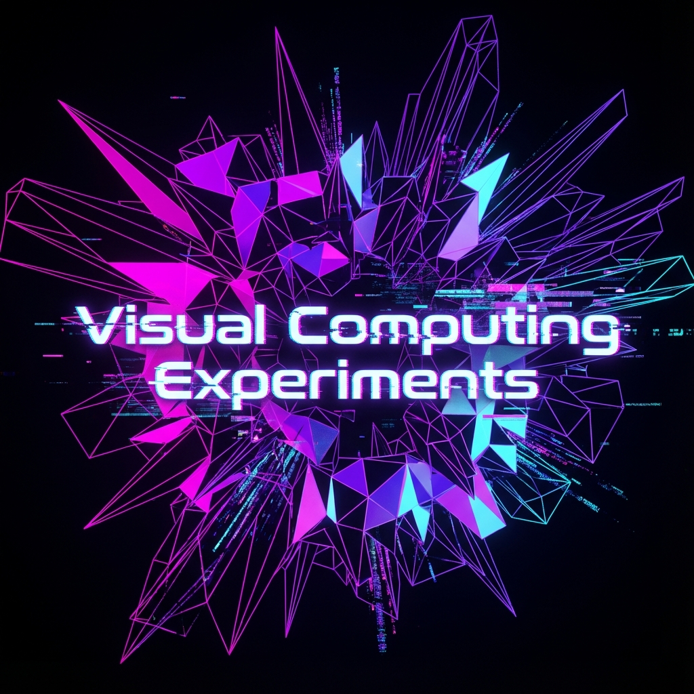

# FrimfeldTech Visual Lab



## 🧪 Overview

**FrimfeldTech Visual Lab** is an experimental playground for procedural generation, real-time graphics, and technical art. It serves as a testbed for integrating code with visual creativity, exploring the boundaries of what's possible with **Unreal Engine 5**, **Blender API**, and custom shaders.

## 🎨 Tech Stack

- **Procedural Generation**: Python (Blender API `bpy`)
- **Real-Time Engine**: Unreal Engine 5 (C++ & Blueprints)
- **Graphics Programming**: HLSL / GLSL Shaders

## 🌟 Experiments

- **Procedural Cities**: Algorithms to generate sci-fi cityscapes automatically in Blender.
- **Interactive Shaders**: Custom shader logic for reactive environments.
- **Tool Development**: Utilities to accelerate the 3D workflow.

## 📂 Structure

```
/frimfeldtech-visual-lab
|-- /blender_scripts      # Automation for 3D modeling
|-- /unreal_tools         # UE5 Plugins & Utilities
|-- /shaders              # Visual experiments
|-- /showcase             # Results gallery
```

## 👁️ Vision

To bridge the gap between rigorous software engineering and expressive digital art.
